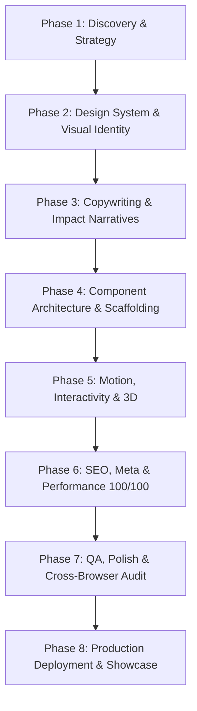

# Portfolio Master Orchestrator

The Master Orchestrator guides the complete lifecycle of creating a world-class, modern, high-converting professional portfolio website. It enforces the Superpowers engineering methodology: rigorous requirements discovery, tailored design systems, authentic storytelling, modular component architecture, 60fps micro-interactions, SEO/performance auditing, and multi-device QA polish.

<HARD-GATE>
Do NOT begin scaffolding components or writing HTML/CSS/JS until the Discovery Strategy (`portfolio-discovery-strategy`) and Design System (`portfolio-design-system`) stages have been fully presented to and explicitly approved by the user. Building without alignment leads to generic, cookie-cutter templates.
</HARD-GATE>

---

## The 8-Phase Portfolio Lifecycle

### Phase Breakdown & Skill Mapping

1. **Phase 1: Discovery & Brand Strategy**
   - **Active Skill**: [`portfolio-discovery-strategy`](../portfolio-discovery-strategy/SKILL.md)
   - **Goal**: Identify brand archetype, target audience (recruiters, clients, founders), core competencies, priority projects, and primary conversion goal.
   - **Deliverable**: Approved Portfolio Brief & Brand Persona.

2. **Phase 2: Design System & Visual Identity**
   - **Active Skill**: [`portfolio-design-system`](../portfolio-design-system/SKILL.md)
   - **Goal**: Generate cohesive design tokens: curated typography pairings, dark/light HSL palettes, glassmorphism tokens, and micro-elevation scales.
   - **Deliverable**: Approved Design Tokens & Theme Foundation (`index.css` variables).

3. **Phase 3: Copywriting & Impact Narratives**
   - **Active Skill**: [`portfolio-copywriting-storytelling`](../portfolio-copywriting-storytelling/SKILL.md)
   - **Goal**: Formulate hook taglines, metric-driven STAR case studies, bio narratives, and high-conversion CTAs.
   - **Deliverable**: Approved Content Inventory & Project Stories.

4. **Phase 4: Component Architecture & Scaffolding**
   - **Active Skill**: [`portfolio-component-architecture`](../portfolio-component-architecture/SKILL.md)
   - **Goal**: Build modular, accessible HTML/semantic component blocks: Hero, Featured Projects, Career Timeline, Skills Matrix, Interactive Lab/Playground, Testimonials, and Contact Lead Form.
   - **Deliverable**: Semantic, responsive markup with clean component separation.

5. **Phase 5: Motion, Interactivity & 3D**
   - **Active Skill**: [`portfolio-interactive-motion`](../portfolio-interactive-motion/SKILL.md)
   - **Goal**: Implement zero-jank 60fps micro-interactions: smooth scrolling, interactive canvas/particle background, 3D card tilt, magnetic buttons, and scroll-triggered reveals with `prefers-reduced-motion` safety.
   - **Deliverable**: Dynamic, reactive user experience.

6. **Phase 6: SEO, Performance & Core Web Vitals**
   - **Active Skill**: [`portfolio-seo-performance`](../portfolio-seo-performance/SKILL.md)
   - **Goal**: Implement JSON-LD Schema (`Person`, `ProfilePage`), dynamic OpenGraph social preview tags, image optimization (WebP/AVIF), and Lighthouse 100/100 optimization.
   - **Deliverable**: Perfect Core Web Vitals and rich search previews.

7. **Phase 7: Quality Assurance, Review & Polish**
   - **Active Skill**: [`portfolio-review-polish`](../portfolio-review-polish/SKILL.md)
   - **Goal**: Execute comprehensive QA against multi-device viewport breakpoints (320px mobile to 4K desktop), Safari/iOS quirks, contrast compliance (WCAG AAA), and keyboard navigation.
   - **Deliverable**: Zero-defect, polished showcase ready for launch.

8. **Phase 8: Production Deployment & Analytics**
   - **Active Skill**: [`portfolio-deployment-showcase`](../portfolio-deployment-showcase/SKILL.md)
   - **Goal**: Configure zero-config hosting (Vercel, Cloudflare Pages, GitHub Pages), SSL, custom domains, automated deployment, and privacy-respecting analytics.
   - **Deliverable**: Live, production portfolio with shareable URL.

---

## Anti-Patterns & Red Flags

| Red Flag / Mental Shortcut | Reality | Correct Action |
| :--- | :--- | :--- |
| *"I'll just jump straight to creating HTML/CSS files."* | Skipping discovery and design systems yields generic templates that fail to impress. | Stop at Phase 1. Complete discovery questions and get user approval. |
| *"Let's use placeholder text like 'Lorem ipsum' or 'Passionate developer'."* | Generic copy repels recruiters and makes the site feel unfinished. | Activate `portfolio-copywriting-storytelling` to draft concrete, metric-backed copy. |
| *"Standard blue buttons and default fonts are fine for now."* | A portfolio's visual aesthetic is judged in the first 500 milliseconds. | Activate `portfolio-design-system` to establish custom typography and HSL palettes. |
| *"I'll add mobile responsiveness at the end."* | Retrofitting responsiveness into complex desktop layouts causes layout breaking and jank. | Build mobile-first or inspect responsive fluid scaling (`clamp()`) from Phase 4. |

---

## Execution Checklist

- [ ] **Step 1**: Announce the start of Phase 1 and invoke `portfolio-discovery-strategy`.
- [ ] **Step 2**: Obtain explicit approval on the Discovery Brief.
- [ ] **Step 3**: Invoke `portfolio-design-system` to create and confirm design tokens.
- [ ] **Step 4**: Invoke `portfolio-copywriting-storytelling` to draft content & case studies.
- [ ] **Step 5**: Invoke `portfolio-component-architecture` to construct component sections.
- [ ] **Step 6**: Invoke `portfolio-interactive-motion` to integrate 60fps animations.
- [ ] **Step 7**: Invoke `portfolio-seo-performance` to optimize meta, structured data, and assets.
- [ ] **Step 8**: Invoke `portfolio-review-polish` for multi-device and accessibility QA.
- [ ] **Step 9**: Invoke `portfolio-deployment-showcase` to prepare deployment artifacts.
